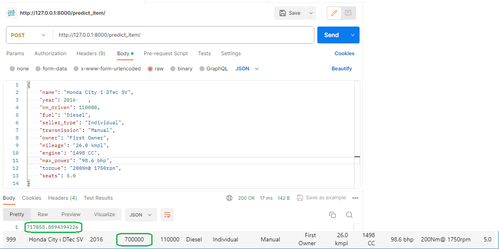
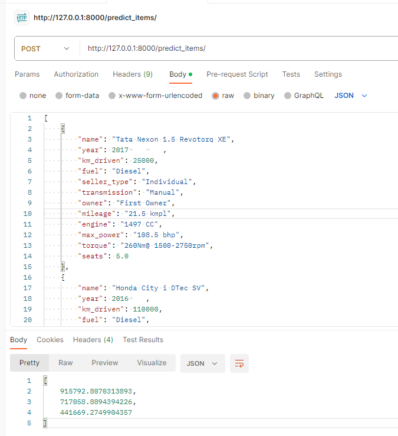

# Что было сделано
Была проведена работа по обучению модели **линейной регресии**, предсказывающей стоимость автомобиля по его параметрам.

## Подготовка данных
Данные были определенным образом обработаны: заполнены пропуски, признаки строкового вида были преобразованы к численному с удалением не влияющих на целевую переменную символов, было произведено One-hot-кодирование категориальных признаков.

Был преведен **EDA-анализ**, в ходе которого были оценены отношения между признаками и целевой переменной, выявлены зависимости. На его основании была осуществлена модификация некоторых признаков, а также были созданы новые признаки, которые должны были добавить дополнительную ценность в данные.

## Подбор гиперпараметров модели
При помощи класса `GridSearchCV` библиотеки `sklearn` были подобраны оптимальные гиперпараметры для модели, при которых наблюдалась максимальная точность предсказаний.

## Регуляризация
Было оценено влияние использования L1 (**лассо регрессия**) и L2 (**гребневая регрессия**) регуляризаторов, а также их комбинации (**elastic net**) на качество предсказаний модели. Был выбран наиболее подходящий регуляризатор.

## Метрики
Качество модели оценивалась по метрикам **MSE** и $R^2$. Также  Была написана метрика, вычисляющая процент предсказаний, отличающихся на реальной стомости не более, чем на 10%.

## Обучение
С учетом всего вышеописанного на подготовленных данных была обучена модель **гребневой регресии**.

## Реализация сервиса
Был создан API сервис, принимающий признаковое опсиание одного или множества автомобилей, и возвращающий предсказание его стоимости.

# С какими результатами
Конечная модель продемонстировала следующую производительность на тестовой части датасета:
- **MSE**: 200257738309.83243
- $R^2$: 0.6516217986293107
- **Процент близких предсказаний**: 0.214

# Что дало наибольший буст в качестве
Наибольший рост в значениях метрки наблюдался после проведения One-hot-кодирования категориальных признаков. Подбор оптимальных гиперпараметров (таких, как коэффициент регуляризации `alpha` и `l1_ratio` в моделях `lasso` и `elastic_net`) с помощью кросс-валидации способствовал незначительному повышению точности предсказаний.

# Что сделать не вышло
Не оправдались предположения о том, что точность предсказаний улучшится после проведения логарифмирования признаков `year` и `engine`, имеющих отличное от нормального распределение, либо введения нового признака `кол-во лошадиных сил на литр объема двигателя`.

Также не смотря на то, что точность модели, измеренная через метрики **MSE** и $R^2$ улучшалась после One-hot-кодирования категориальных признаков, логарифмирования признака `km_driven` и вовзедения в квадрат признака `year`, значение метрики **процент близких предсказаний** после данных интервенций, наоборот, снизилось.

# Примеры работы
## Предсказание по 1 объекту

## Предсказание по нескольким объектам
